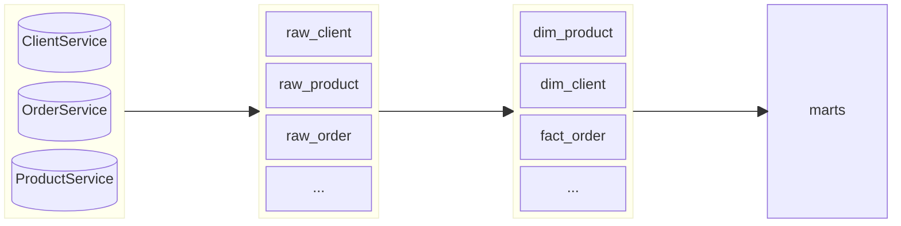

## Тестовая БД

Тестовая БД представляет хранилище данных интернет-магазина (маркетплейса). 

Данные из операционных БД отдельных сервисов агрегируются на слое сырых данных, после чего попадают в таблицы измерений и таблицы фактов (детальный слой). На основе детального слоя строятся прикладные витрины.

