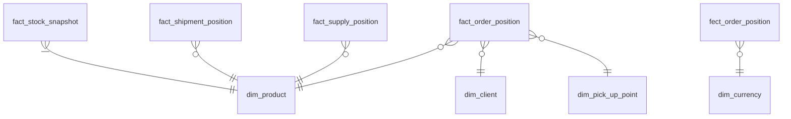
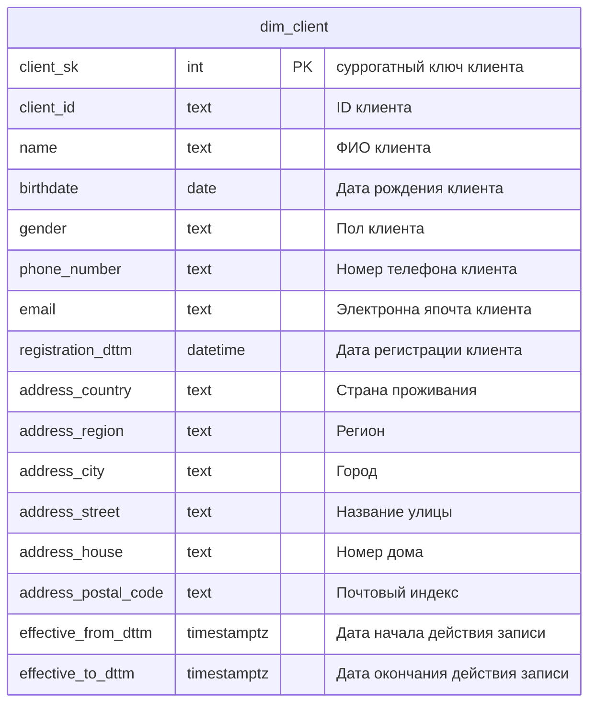
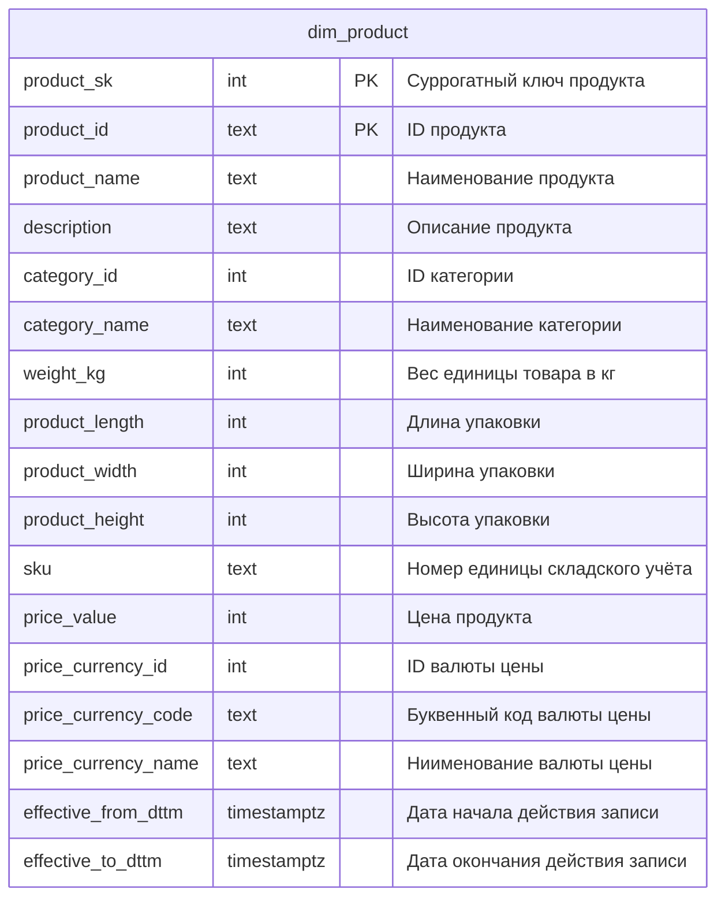
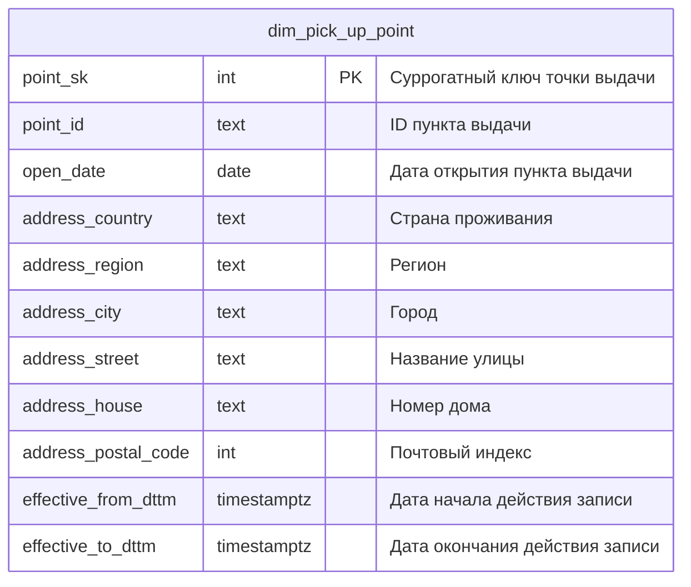
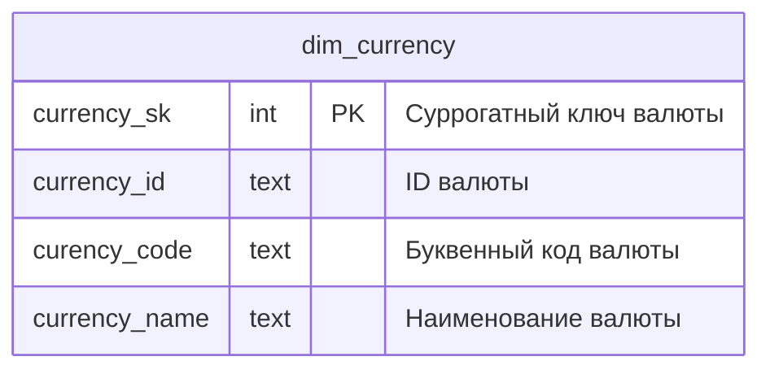
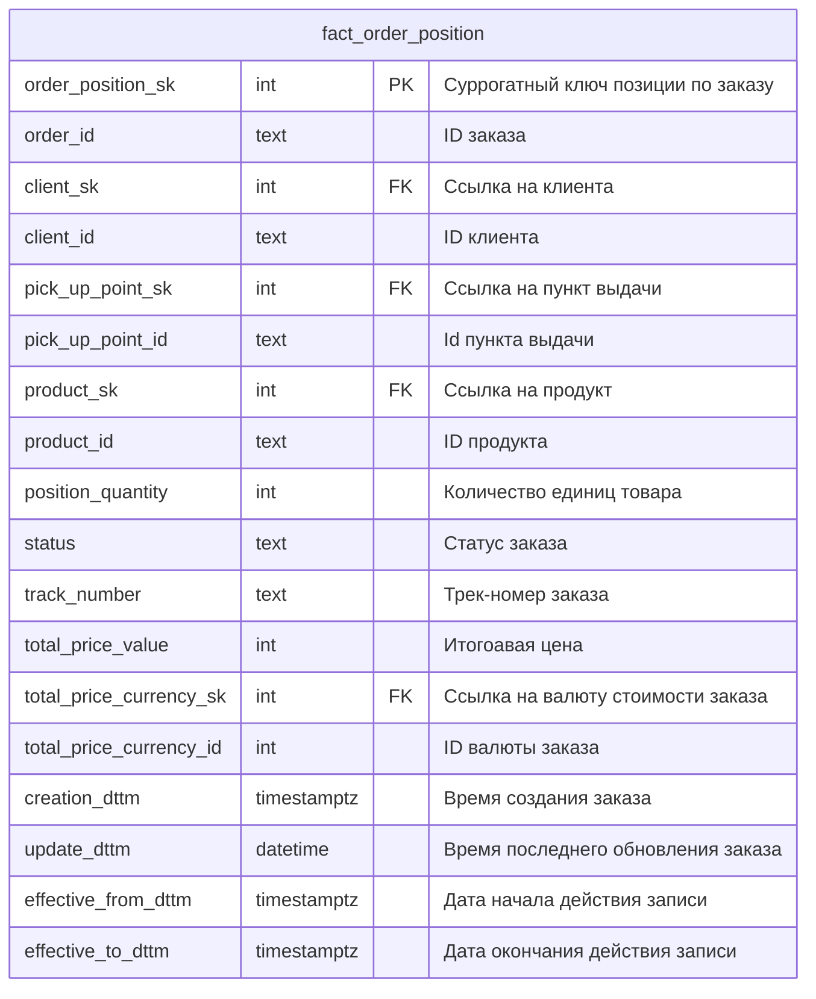
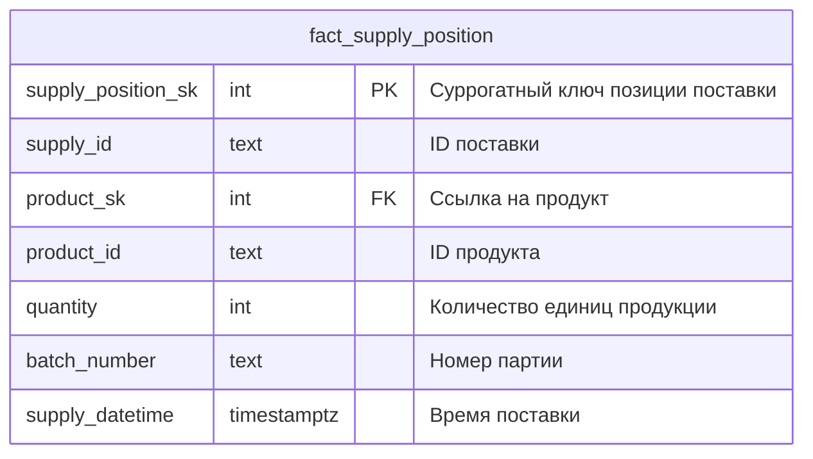
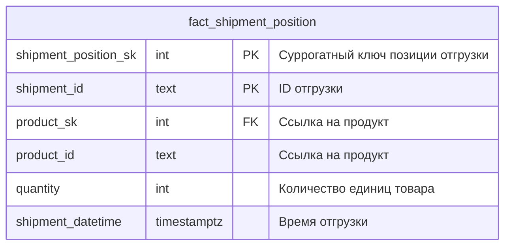
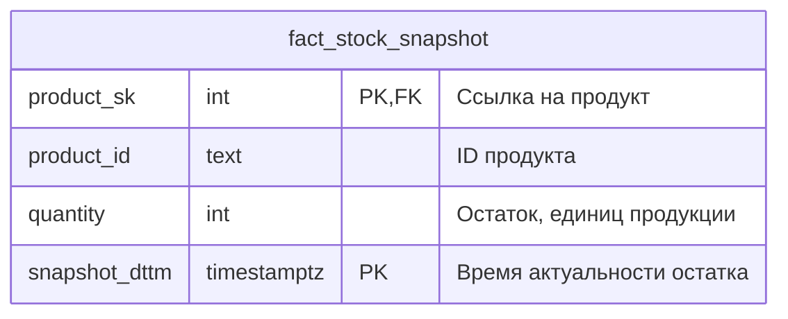

# Слой базовых витрин

Слой базовых витрин построен в соответствии с классической "звездой" Кимбалла. Данные из слоя сырых данных аггрегированы и уплощены.

Имеем таблицы измерений:
- Продукты
- Клиенты
- Пункты выдачи
- Валюты

И факты:
- Заказы
- Поступления на склад
- Отгрузки со склада
- Учёт остатков

## Общая схема

Ниже представлене концептуальная схема слоя.

> Да, не очень-то похоже на звезду :)

## Таблицы слоя базовых витрин

Далее приведено описание каждой из таблиц слоя бдазовых витрин.

### dim_client

### dim_product

### dim_pick_up_point

### dim_currency

### fact_order_position

### fact_supply_position

### fact_shipment_position

### fact_stock_snapshot

