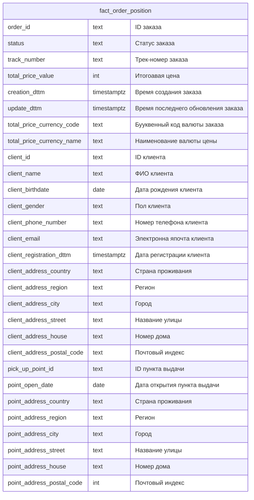
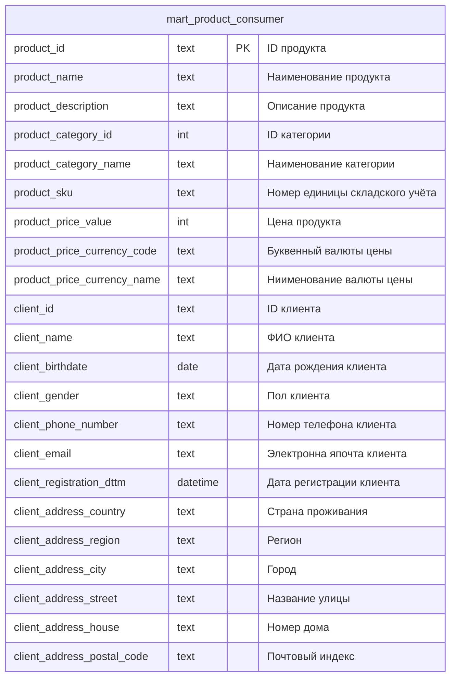

# Слой прикладных витрин

Слой прикладных витрин представлен специализированными витринами данных, сохданными под нужны бизнес-пользователей.

## Агрегированная информация по заказам (mart_agg_client_order)

Сводные данные по заказам - какой клиент, на какой пункт выдачи делал заказы.

## Данные по спросу (mart_product_consumer)

Представлены данные о том, какие клиенты (пол, возраст, регион) покупают тот или иной товар.

