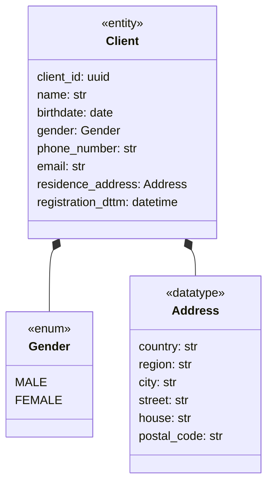
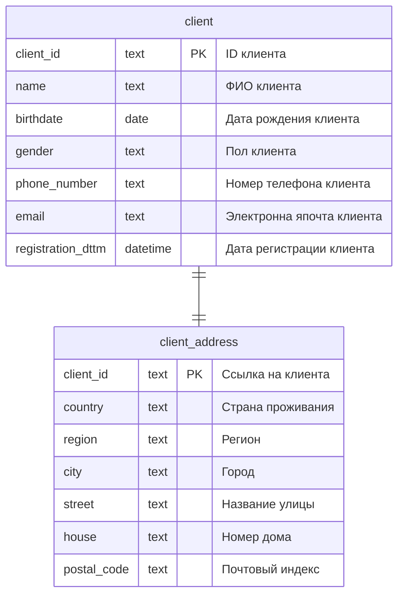
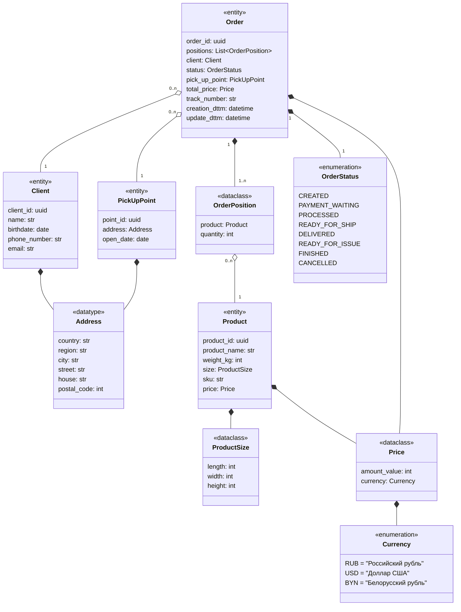
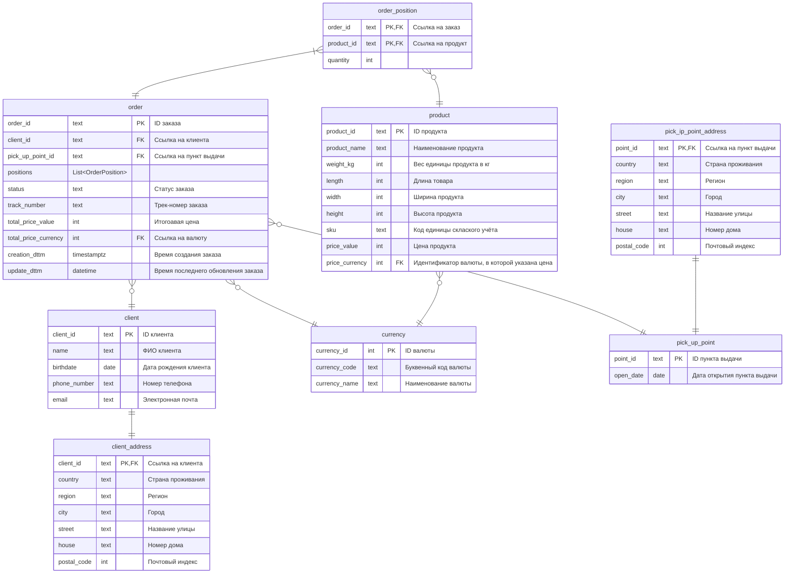
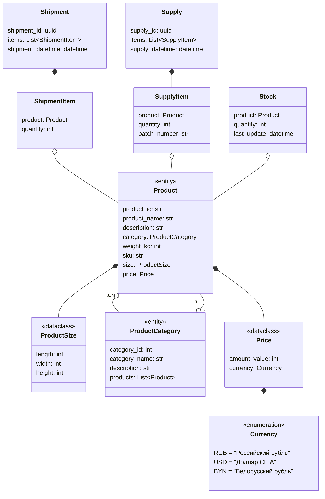
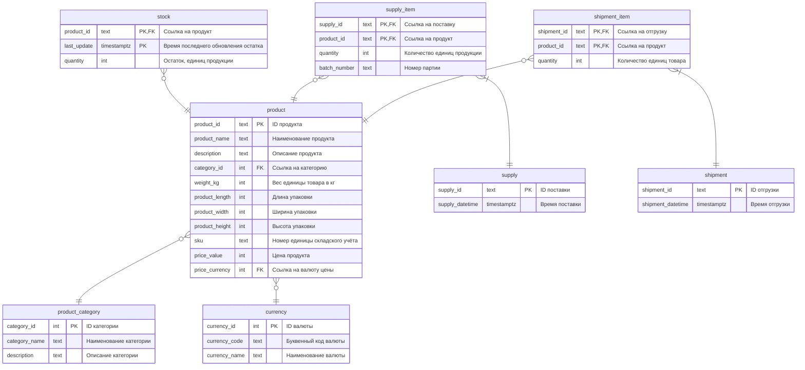

# Сервисы предприятия

На этом уровне представлена диаграмма классов для сервисов интернет-магазина (маркетплейса). Приводится описание основных сущностей на уровне сервисов, а также их проекция на таблицы операционных БД сервисов.

Данный уровень представления нужен для понимания структуры исходных данных, передаваемых в хранилище данных.

## Клиентский сервис

Сервис, отвечающий за данные профиля клиента. Не порождает транзакционных данных.

### Диаграмма классов

### ER-диаграмма операционной БД

## Сервис заказов

Сервис, отвечающий за обработку заказов. 

Сущности, разделяемые с другими сервисами:
- Клиент
- Продукт
- Категория продуктов

Транзакционные данные:
- Заказы

### Диаграмма классов

### ER-диаграмма операционной БД

## Сервис складских остатков

Сервис, отвечающий за учёт складских остатков.

Сущности, разделяемые с другими сервисами:
- Продукт

Транзакционные данные:
- Поступления продуктов (ProductEntrance)
- Отгрузка подуктов (ProductShipment)
- Остатки по продукту

### Диаграмма классов

### ER-диаграмма операционной БД

