# Слой сырых данных

Ниже представлены таблицы слоя сырых данны. Это исторические данные, полученные от источников "как есть".

Некоторые связанные сущности приведены к плоскому виду. Каждая запись имеет код системы-источника и дату загрузки.

## raw_client

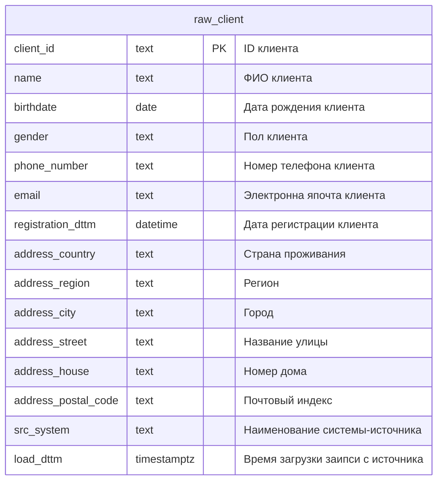

## raw_product

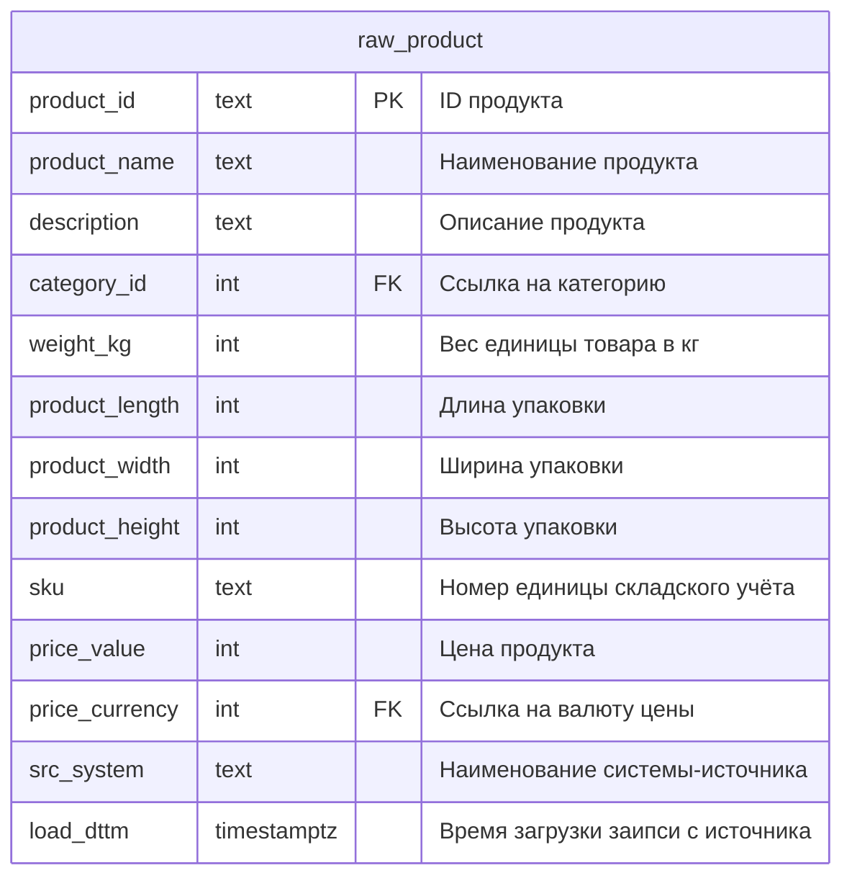

## raw_category

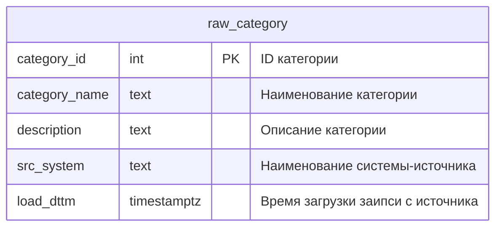

## raw_currency

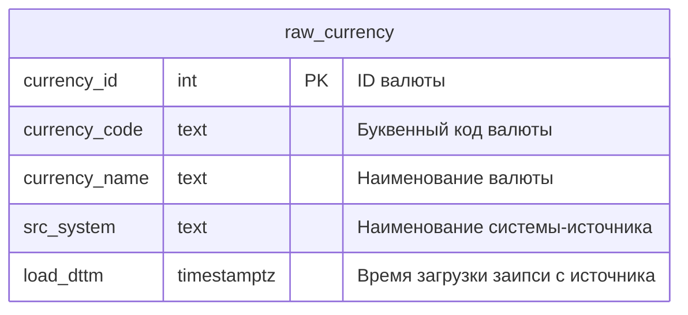

## raw_stock

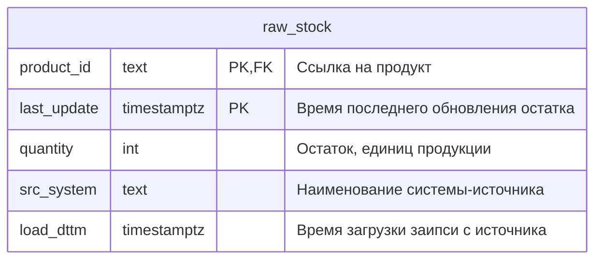

## raw_supply

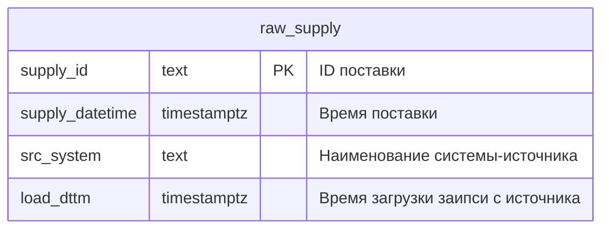

## raw_supply_item 

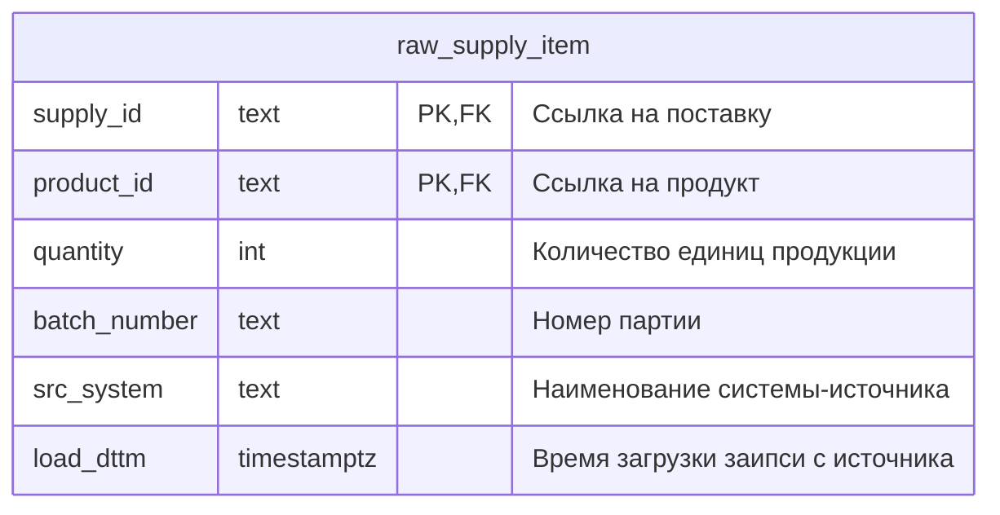

## raw_shipment

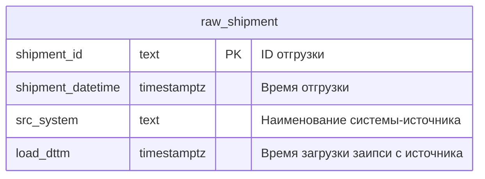

## raw_shipment_item

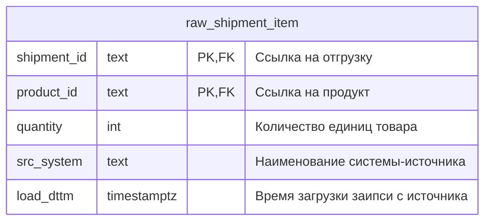

## raw_order

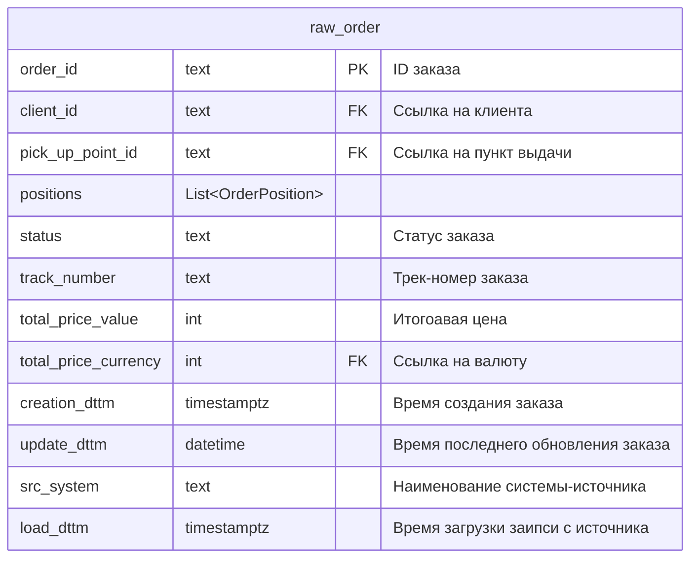

## raw_order_position

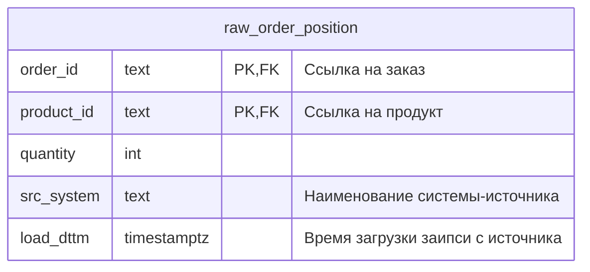

## raw_pick_up_point
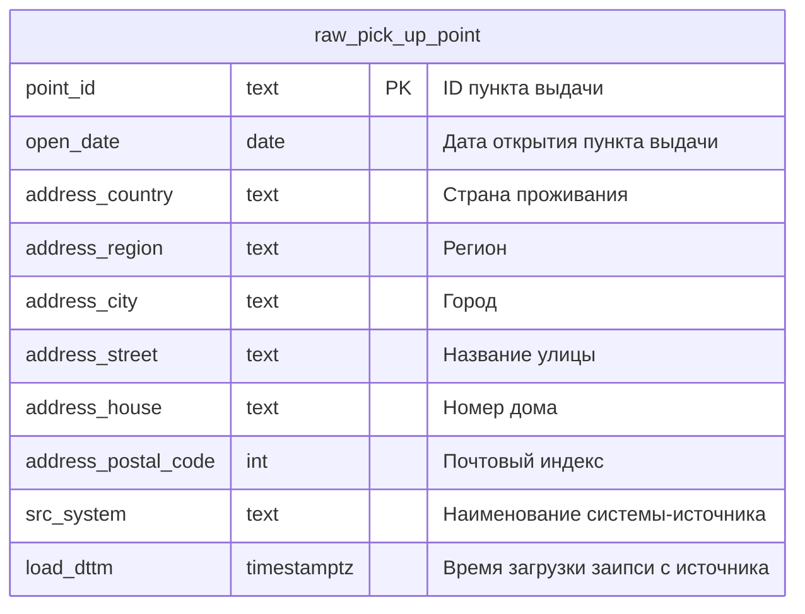
